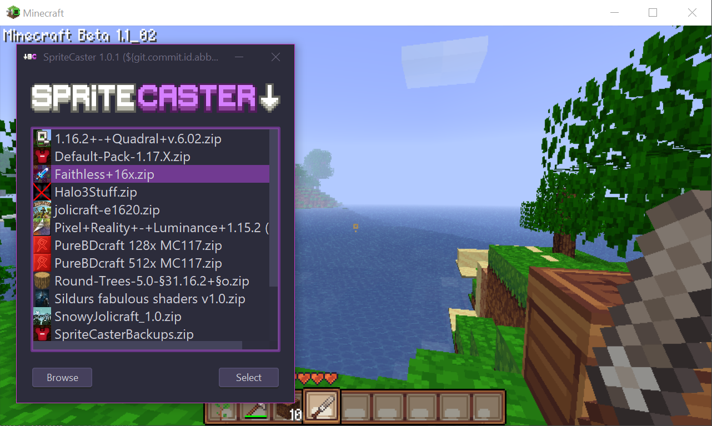

# 

Convert Minecraft Resource Packs to Texture Packs

[Get the Latest Version!](https://github.com/craftycodie/SpriteCaster/releases/latest)

 

## What is SpriteCaster?
SpriteCaster allows you to convert modern minecraft textures for release versions into texture packs compatible with older versions. It essentially allows you to backport resource packs. 

### What works?
All unchanged blocks and textures work as you'd expect in older versions!

- Animated blocks like water, lava, fire and portals are converted back to the old MC Patcher format.
- HD texture packs are supported.
- Chests are roughly expanded to suit larger blocks.
- Beds work fine!
- Comapasses and Clocks are backported using a format superior to the MC Patcher format, you will need MineOnline to use these.
- Blocks which have grey textures in release (like grass) are tinted an appropriate color.

### What doesn't work?
- Most notably, the inventory screen remains unchanged, due to the release one being too different.
  - You can include a suitable inventory texture in a resource pack if you wish, at `assets\minecraft\spritecaster\gui\container\inventory_v1.png`
- Boat entities are not yet converted.
- Most release packs don't have bed icons these days. They will be used if present, but if not the default icon will be used.

